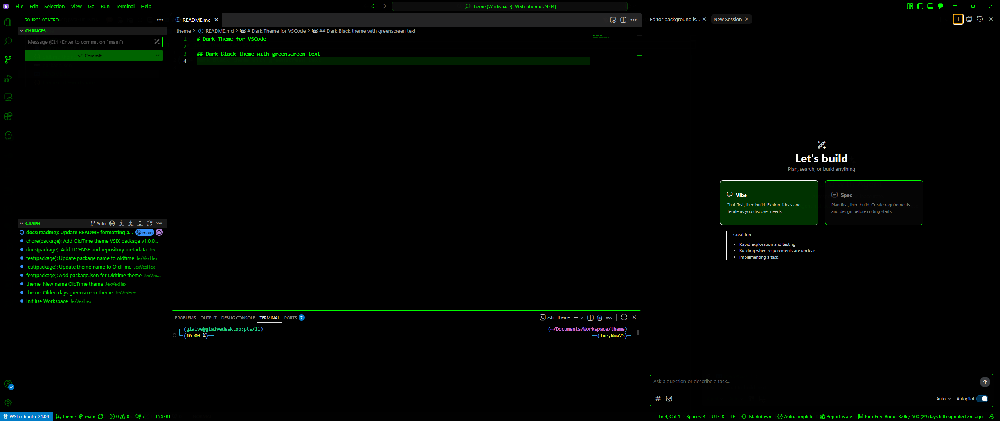

# Dark Theme for VSCode

## Dark Black theme with greenscreen text

## Preview

## Changelog

- 2025-12-19: Added blue separators and focus borders (e.g. `editorGroup.border`, `sideBar.border`, `panelTitle.activeBorder`, `sash.hoverBorder`) to improve window and panel distinction.
